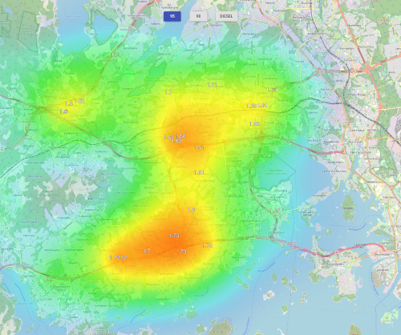

# polttoaine-saa-frontend

This is the frontend for fuel price weather map service: https://marcholio.github.io/polttoaine-saa-frontend. It shows fuel prices in Espoo as a heatmap, indicating where the highest prices are. Check this [repository](https://github.com/Marcholio/polttoaine-saa-backend) for the backend project.



## Overall design

The service is based on [Open Layers](https://openlayers.org/) with [OpenStreetMap](https://www.openstreetmap.org) as a base map. The fuel price data is fetched from [custom API](https://github.com/Marcholio/polttoaine-saa-backend).

## Setting up development environment

### Prerequisites

- [Yarn](https://yarnpkg.com/)
- [API deployed in AWS](https://github.com/Marcholio/polttoaine-saa-backend)

### Installation

Install dependencies:

```
yarn
```

Create `.env`file. See template `.env.template` folder. Add your API url and API key to file. Ensure that you have localhost allowed in cors-origin on the backend side.

Start local environment:

```
yarn start
```

The script opens browser to "http://localhost:3000/polttoaine-saa-frontend" and you can start the development.

### Deployment

The frontend is hosted on [GitHub pages](https://pages.github.com/).

You can deploy the service by running `yarn deploy`, which will build the project and deploy `build` folder to `gh-pages` branch.

## License

Licensed under MIT license. See LICENSE for further information.

## Known limitations

- Heatmap is not an ideal visualisation for preferring lower prices.
